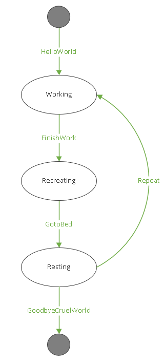

# Automatonymous Unit Test Example
This repo contains a sample Automatonymous saga and a corresponding set of unit tests.
Unit tests are executed with MsTest.

The state machine implemented by the saga:

